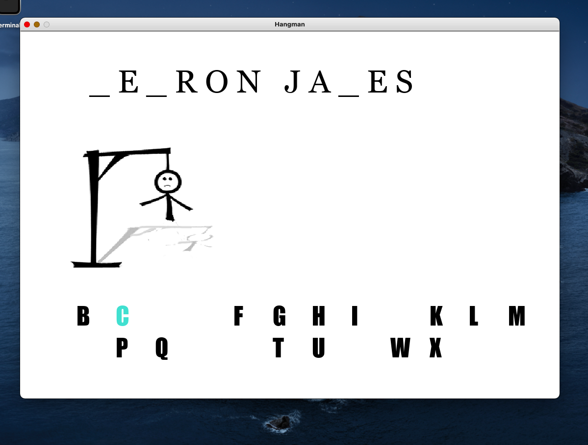

# Hangman

The Hangman game. Guess the mystery phrase before the hangman is complete!

# General

This is a simple single-player game. There will be a mystery phrase, all the letters, and an image of the hangman. As the player 
enters in letters, the mystery phrase slowly gets revealed, or the hangman gets an additional limb!

# Technology/Tools

- Made using Pygame
- Made on PyCharm
- Python version 3.9
